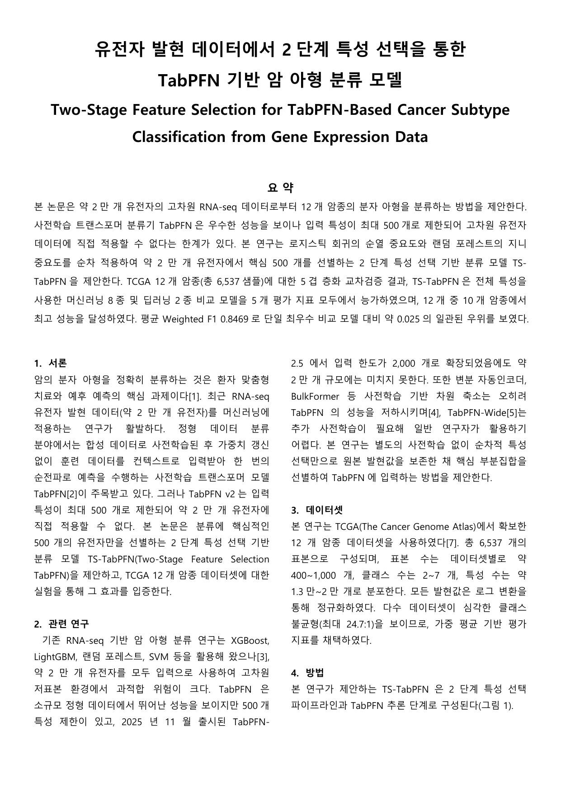

# TabPFN-Anchor M1

**Multi-Stage Feature Selection with TabPFN (M1) for High-Dimensional Cancer Subtype Classification**

[**📄 논문 PDF 원본 열기 (GitHub 내장 뷰어)**](kcc_paper_tabpfn_m1.pdf)



A focused study demonstrating that a **single TabPFN model (M1)** trained on 500 genes selected by our multi-stage pipeline (LR PI → RF Gini → TabPFN+SHAP) outperforms traditional ML models using the full ~20,000 gene expression matrix.

---

## Overview

This is a companion study to [TabPFN-Anchor-Stacking](https://github.com/DamHiyo/TabPFN-Anchor-Stacking), focused on the **M1 (single model, no stacking)** scenario. The key claim is:

> **500 features selected by RF6K pipeline + a single TabPFN model outperforms 8 traditional ML models that use all ~20,000 genes.**

Pipeline (identical to TabPFN-Anchor-Stacking Stage 1):

1. **Stage 1-1**: Logistic Regression + Permutation Importance (`~20K → 6,000`)
2. **Stage 1-2**: Random Forest + Gini Importance (`6,000 → 500`)
3. **M1**: TabPFN (`n_estimators=32`) on 500 features → final prediction

Submission target: **한국정보과학회 KCC** (Korea Computer Congress, 한국컴퓨터종합학술대회), summer 2026.

---

## Results Highlights

Evaluated on **12 TCGA cancer types** (6,537 total samples, 5-fold stratified CV):

| Model | F1 (W) | ACC | AUROC |
|-------|--------|-----|-------|
| **TabPFN-Anchor (M1)** | **0.8469** | **0.8501** | **0.9548** |
| LightGBM (best ML)    | 0.8220 | 0.8321 | 0.9511 |
| CatBoost              | 0.8105 | 0.8245 | 0.9538 |
| XGBoost               | 0.8125 | 0.8214 | 0.9470 |
| RandomForest          | 0.7582 | 0.7844 | 0.9387 |
| MLP (deep learning)   | 0.7810 | 0.7868 | 0.9041 |
| TabNet                | 0.6479 | 0.6749 | 0.8002 |

- **10 / 12 cancer types: TabPFN-Anchor (M1) ranks 1st** (THCA, UCEC are narrow losses, $\leq 0.011$ F1 gap)
- Uses only **500 features** vs. baselines using all ~20,000
- Statistically significant improvement (paired t-test $p < 10^{-4}$ vs. every baseline)

---

## Repository Structure

```
.
├── scripts/
│   ├── feature_ranking/    # Stage 1: multi-stage feature selection
│   │   ├── config.py
│   │   ├── data_loader.py
│   │   ├── step1_lr_permutation_importance.py
│   │   ├── step2_rf_feature_importance.py
│   │   └── step3_tabpfn_shap_anchor.py
│   ├── m1_evaluation/      # Single TabPFN model on selected features
│   │   └── run_tabpfn_m1.py
│   ├── ml_baselines/       # Traditional ML + deep learning baselines
│   │   ├── step5_ml_baselines.py    # 8 ML models
│   │   ├── run_mlp_baseline.py      # MLP (sklearn)
│   │   └── run_tabnet.py            # TabNet (pytorch_tabnet)
│   ├── tables/             # Result table generation
│   │   └── make_tables.py
│   └── shell/              # Batch execution scripts
│       ├── run_all_m1.sh
│       └── run_ml_all.sh
├── tables_csv/             # Result CSVs (T3, T4, T9, T11, T12)
├── figures/                # Figures (M1 vs ML comparison)
├── RF6k_tabpfn.ipynb       # M1 vs ML visualization notebook
├── requirements.txt
├── .gitignore
└── README.md
```

---

## Quick Start

```bash
# 1. Install
pip install -r requirements.txt

# 2. Update data path in scripts/feature_ranking/config.py
#    DATA_SOURCE_DIR = Path("/path/to/your/tcga/data")

# 3. Run feature ranking (per fold)
bash scripts/shell/run_all_m1.sh

# 4. Run ML baselines (for comparison)
bash scripts/shell/run_ml_all.sh

# 5. Generate result tables
python scripts/tables/make_tables.py
```

---

## Datasets

| Dataset | Samples | Features | Subtypes |
|---------|---------|----------|----------|
| BRCA | 995 | 20,531 | 4 |
| COADREAD | 449 | 17,507 | 6 |
| GEA | 461 | 17,691 | 7 |
| KIRCKICH | 556 | 20,531 | 2 |
| SKCM | 444 | 20,531 | 4 |
| THCA | 486 | 20,531 | 3 |
| UCEC | 499 | 17,507 | 4 |
| BLCA | 399 | 20,531 | 6 |
| HNSC | 506 | 20,531 | 5 |
| LGGGBM | 782 | 12,717 | 7 |
| LUAD | 500 | 20,531 | 5 |
| LUSC | 460 | 20,531 | 6 |
| **Total** | **6,537** | | |

Data source: TCGA Pan-Cancer Atlas, processed via CCG-TMP-2022 ([Ellrott et al., Cancer Cell 2025](https://doi.org/10.1016/j.ccell.2024.12.002)).

---

## Hyperparameters

| Parameter | Value | Rationale |
|-----------|-------|-----------|
| LR PI repetitions | 50 | Stable importance |
| LR PI top-N | 6,000 | Conservative margin for non-linear gene recovery |
| RF estimators | 2,000 | Robust Gini convergence |
| RF top-N | 500 | TabPFN architectural token limit |
| TabPFN n_estimators | 32 | Prediction stability |
| CV | 5-fold stratified | Class balance preservation |

---

## Related Work

- **[TabPFN-Anchor-Stacking](https://github.com/DamHiyo/TabPFN-Anchor-Stacking)** — Stacking ensemble extension (K=15 TabPFN sub-models)
- **TabPFN**: Hollmann et al., 2023 ([Nature](https://www.nature.com/articles/s41586-024-08328-6))
- **CCG-TMP-2022**: Ellrott et al., Cancer Cell 2025

---

## Acknowledgments

This research was supported by the University of Suwon.

## License

MIT
